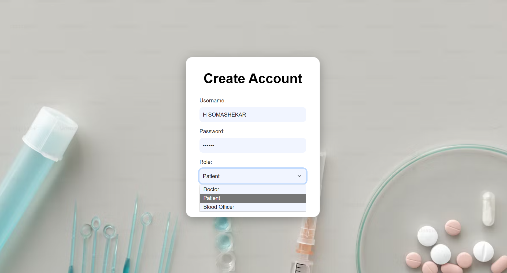
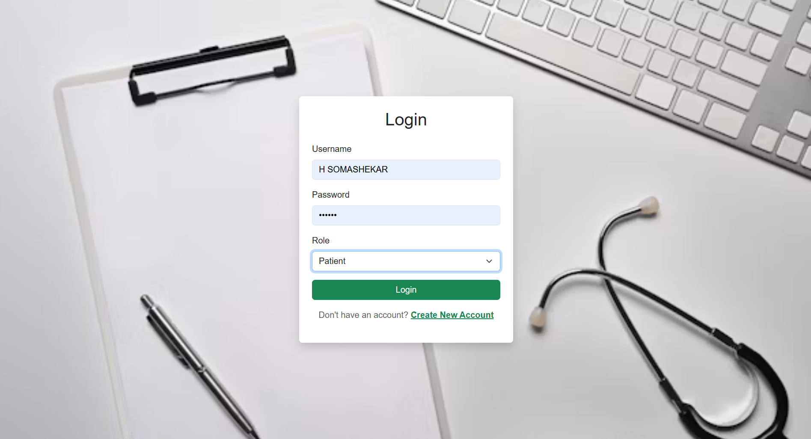
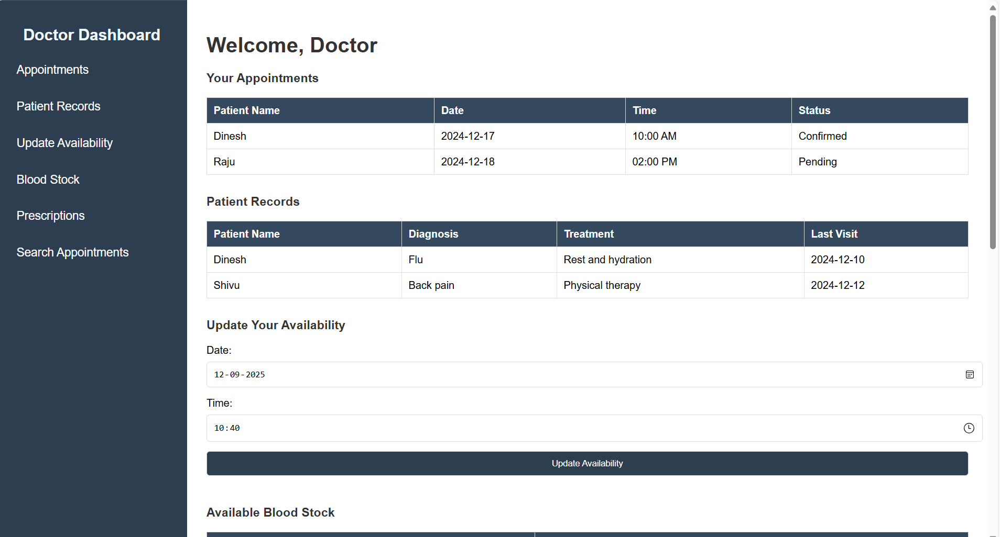
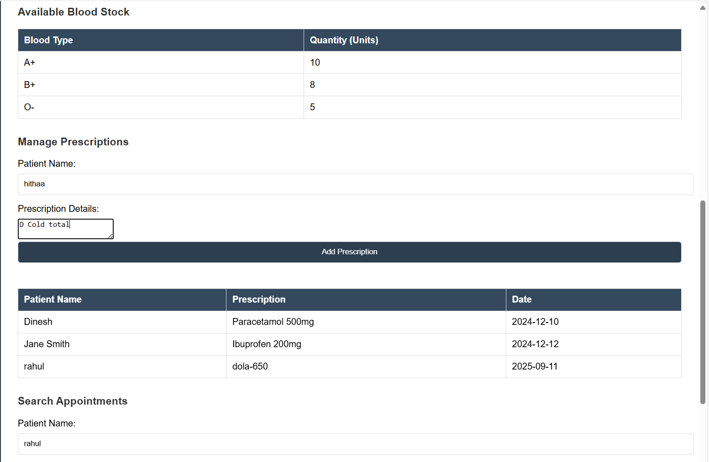
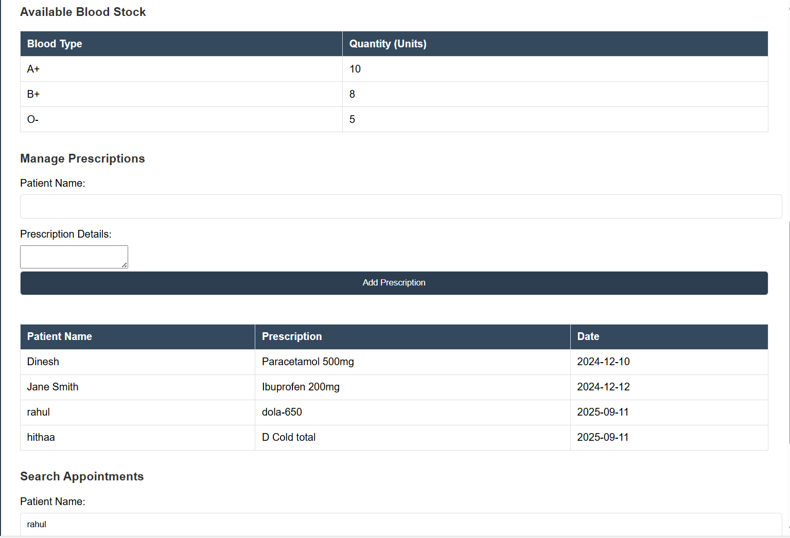
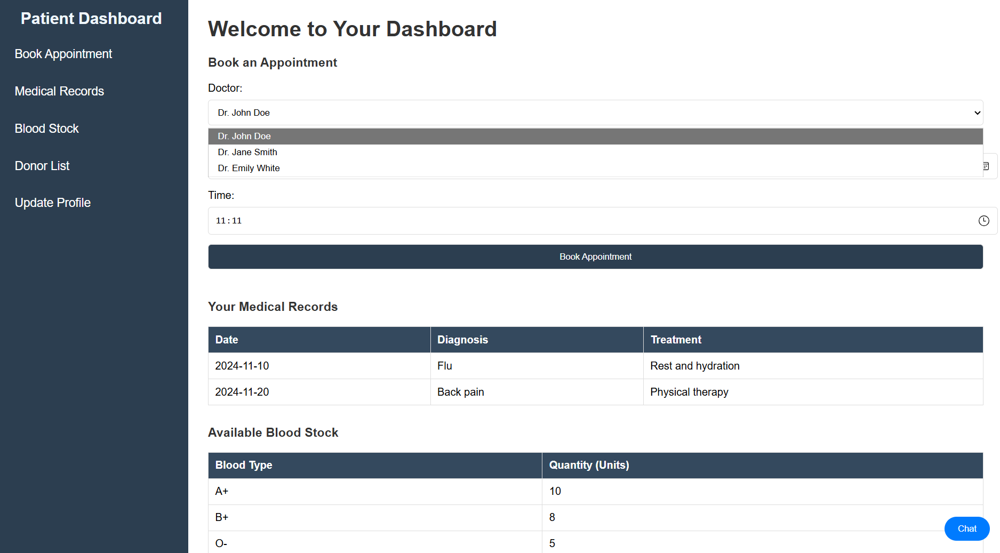
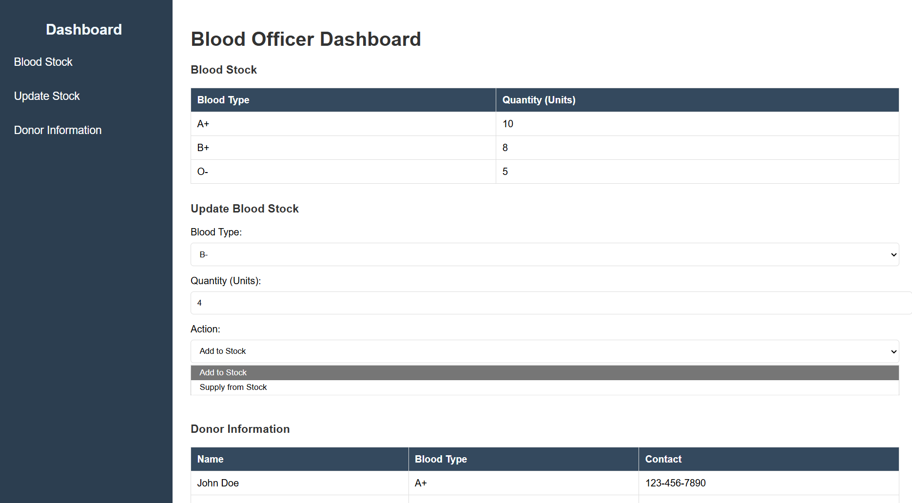
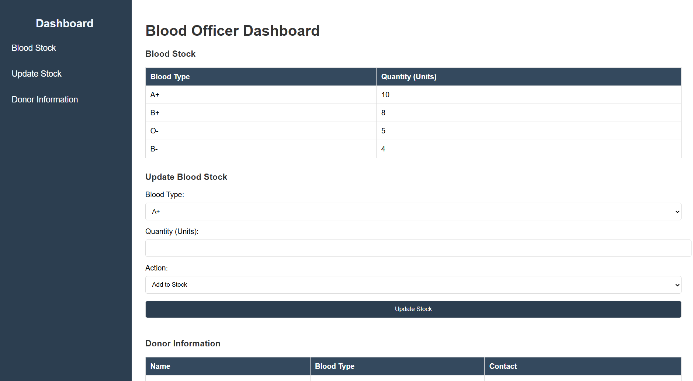
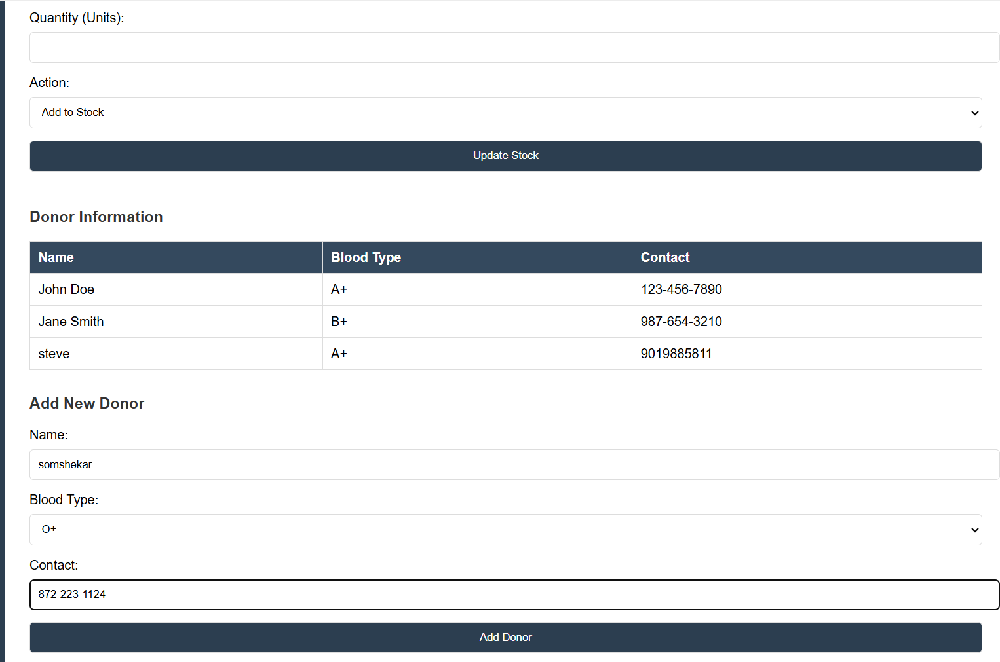
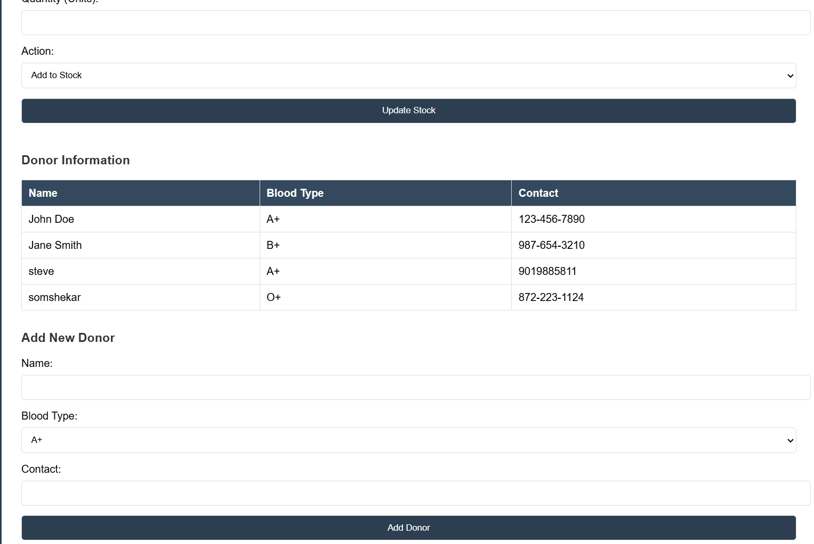

# Arogyaamsha-website for hospital management

# Overview:
Arogyaamsha is a comprehensive hospital management system designed to streamline healthcare operations, featuring patient appointment management, doctor scheduling, blood stock tracking, and donor information management. Developed using Node.js, MongoDB, HTML, and CSS, it ensures efficient hospital workflow and improved patient care.

## Features:

- Role-based login and redirects for doctor, patient, and blood-officer roles.

- Appointments: book, view, and search appointments with basic status and timing.

- Doctor dashboard: upcoming visits, patient records, availability updates, and       prescription management.

- Patient dashboard: book appointments, view medical records, and check blood stock.

- Blood bank: view and update stock (add/supply actions) and manage donor information.

## Tech Stacks:

- Backend: Node.js, Express

- Database: MongoDB (Mongoose)

- Frontend: HTML, CSS,  JS

- Auth utilities: bcrypt for password hashing

- App structure: views for pages, public/ for static assets, server.js for routes and configuration

## Screenshots
</img>
</img>

## Docter Dashboard
</img>
</img>
</img>

## Patient Dashboard
</img>

## Blood Officer Dashboard
</img>
</img>
</img>
</img>

